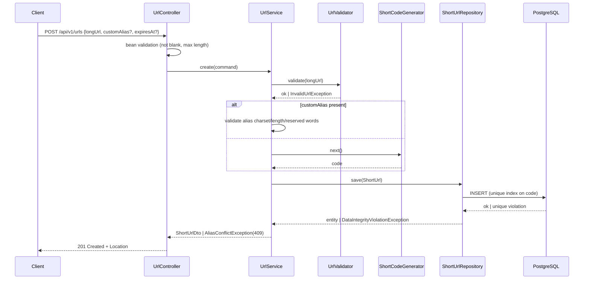
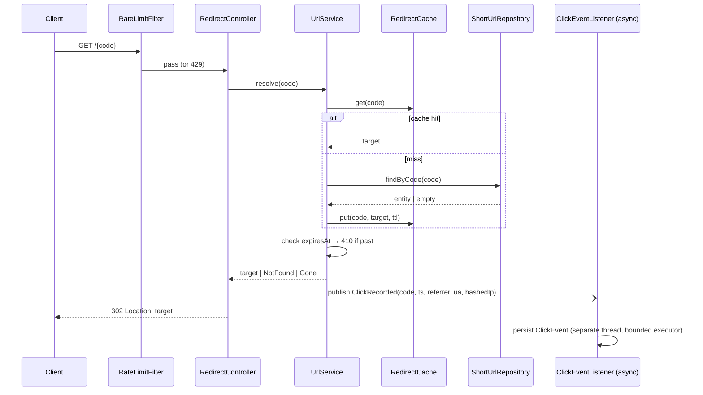
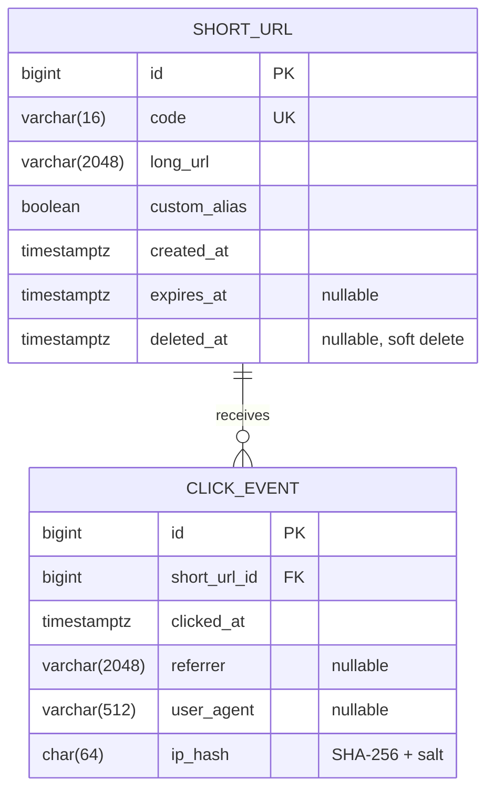

# 02 — Architecture Overview

**Inputs:** `docs/01-requirement-analysis.md` (assumptions AR-1…AR-15)
**Status:** Draft generated with AI assistance (Prompt 2) → pending engineer review
**Constraints applied:** single deployable service; containerized; runs locally with one command; no cloud-only dependencies; buildable in 2–3 days.

---

## 1. System Context

```mermaid
flowchart LR
    Client[API client / browser] -->|POST /api/v1/urls| SVC[URL Shortener Service]
    Client -->|GET /{code}| SVC
    Client -->|GET /api/v1/urls/{code}/stats| SVC
    SVC --> DB[(PostgreSQL)]
    SVC --> CACHE[(Caffeine in-process cache)]
    SVC --> OBS[Actuator: health / metrics / prometheus]
```

One Spring Boot service, one relational database, one in-process cache. Nothing else is required to run the prototype.

---

## 2. Component Diagram

```mermaid
flowchart TB
    subgraph Service["url-shortener (Spring Boot 3, Java 21)"]
        direction TB
        subgraph API["api layer"]
            UC[UrlController<br/>/api/v1/urls]
            RC[RedirectController<br/>/{code}]
            SC[StatsController<br/>/api/v1/urls/{code}/stats]
            EH[GlobalExceptionHandler<br/>RFC 7807]
            RL[RateLimitFilter<br/>(ambiguous scenario)]
        end
        subgraph APP["application layer"]
            US[UrlService]
            AS[AnalyticsService]
            GEN[ShortCodeGenerator<br/>interface]
            VAL[UrlValidator<br/>scheme / length / SSRF]
        end
        subgraph DOM["domain"]
            E1[ShortUrl]
            E2[ClickEvent]
        end
        subgraph INFRA["infrastructure"]
            R1[ShortUrlRepository]
            R2[ClickEventRepository]
            CH[RedirectCache<br/>Caffeine]
            EV[ClickEventListener<br/>@Async]
            FW[Flyway migrations]
        end
    end
    UC --> US
    RC --> US
    RC -. publishes ClickRecorded .-> EV
    SC --> AS
    US --> GEN
    US --> VAL
    US --> R1
    US --> CH
    AS --> R2
    EV --> R2
    R1 --> PG[(PostgreSQL)]
    R2 --> PG
```

### Layer responsibilities

| Layer | Owns | Must not |
|-------|------|----------|
| api | HTTP mapping, request/response DTOs, validation annotations, problem+json errors | Contain business rules or touch repositories |
| application | Use cases, transactions, orchestration, code generation, validation policy | Know about HTTP |
| domain | Entities, value objects, invariants | Depend on Spring web or JPA annotations beyond persistence mapping |
| infrastructure | Persistence, caching, async event handling, migrations | Contain use-case logic |

---

## 3. Control Flow

### 3.1 Shorten (write path)



### 3.2 Redirect (hot read path)



Redirect returns **before** the analytics write; analytics failure never affects the redirect.

---

## 4. Option Analysis

### 4.1 Short-code generation

| Option | How | Pros | Cons / failure modes |
|--------|-----|------|----------------------|
| **A. Base62 of DB sequence** | `nextval('shorturl_seq')` → base62 encode → optional bijective shuffle | Zero collisions, O(1), short codes, trivially testable | Sequential → enumerable/guessable unless obfuscated; ties ID generation to the DB (scaling limit) |
| B. Random alphanumeric (7 chars, SecureRandom) | Generate; retry on unique violation | Non-guessable; DB-independent; horizontally scalable | Collision probability grows with table size; requires retry loop; harder to reason about in tests |

**Recommendation:** **B (random) as default**, with A available behind an interface. Rationale: non-enumerability is a real security property for a shortener (prevents scraping private links), retry-on-collision is cheap at prototype scale (62⁷ ≈ 3.5 × 10¹² space), and the interface + config switch gives a clean refactor target for the brownfield scenario (Prompt 9).
Failure scenario guarded: collision → `DataIntegrityViolationException` → bounded retry (3) → 503 if exhausted (logged, metric incremented).

### 4.2 Storage

| Option | Pros | Cons |
|--------|------|------|
| **A. PostgreSQL (Docker profile)** | Durable, unique constraints enforced by DB, JPA/Flyway mature, matches "production-grade" | Needs Docker for the evaluator |
| B. H2 file/in-memory | Zero setup | Not production-shaped; subtle SQL dialect differences; weak signal to graders |
| C. Redis only | Very fast reads | Weak durability story; no relational analytics queries; adds an extra service |

**Recommendation:** **A for runtime, H2 for unit-level tests, Testcontainers Postgres for integration tests.** Uniqueness and concurrency correctness must be proven against the real engine. (Confirms AR-8.)

### 4.3 Caching

| Option | Pros | Cons |
|--------|------|------|
| **A. Caffeine (in-process)** | No extra service; sub-microsecond reads; bounded size + TTL; trivial to test | Per-instance cache; not shared across nodes; invalidation on delete is local only |
| B. Redis | Shared across instances; supports distributed rate limiting too | Extra container; more setup; overkill for single node |

**Recommendation:** **A.** Single deployable per constraints. Document that multi-node deployment would swap to Redis via Spring Cache abstraction (`@Cacheable` keeps the code unchanged). Cache TTL ≤ shortest expiry granularity to avoid serving expired links from cache; expiry is also re-checked on hit.

### 4.4 Analytics capture

| Option | Pros | Cons |
|--------|------|------|
| A. Synchronous insert in redirect | Simplest; exactly-once | Adds a DB write to the hot path; DB outage breaks redirects |
| **B. Spring `ApplicationEvent` + `@Async` bounded executor** | Redirect latency unaffected; failure isolated; no new infrastructure | At-most-once (events lost on crash/queue full); single-node |
| C. Kafka topic + consumer | Durable, replayable, scalable, matches Sam's platform experience | Extra broker container; consumer, serialization, DLQ — too much for 2–3 days |

**Recommendation:** **B.** Accept at-most-once for click analytics (documented trade-off — losing a click is acceptable; blocking a redirect is not). Queue rejection policy: `CallerRunsPolicy` is **rejected** (would slow redirects); use `DiscardPolicy` with a dropped-events metric. Kafka noted as the production upgrade path in ADR-004.

### 4.5 Rate limiting (ambiguous scenario — decision deferred to `docs/06`)

Architecture reserves a servlet `OncePerRequestFilter` slot before controllers and a `RateLimiter` interface. Backing store (in-memory token bucket via Bucket4j vs Redis) is decided in the ambiguity-resolution step, not here.

---

## 5. Data Model (initial)



`CLICK_EVENT` arrives in migration **V2** during the brownfield scenario; V1 contains only `SHORT_URL`. Indexes: `short_url(code)` unique; `click_event(short_url_id, clicked_at)` for daily aggregation.

---

## 6. API Surface (summary — full spec in `openapi.yaml`)

| Method | Path | Purpose | Success | Errors |
|--------|------|---------|---------|--------|
| POST | `/api/v1/urls` | Create short link | 201 | 400 invalid, 409 alias taken, 422 unsafe host |
| GET | `/{code}` | Redirect | 302 | 404 unknown, 410 expired/deleted, 429 rate limited |
| GET | `/api/v1/urls/{code}` | Metadata | 200 | 404 |
| DELETE | `/api/v1/urls/{code}` | Soft delete | 204 | 404 |
| GET | `/api/v1/urls/{code}/stats` | Analytics | 200 | 404 |
| GET | `/actuator/health`, `/actuator/prometheus` | Ops | 200 | — |

All errors use RFC 7807 `application/problem+json`.

---

## 7. Tooling & Quality Gates

| Concern | Tool | Gate |
|---------|------|------|
| Build | Maven, Java 21 | `mvn verify` green |
| Formatting/lint | Spotless (google-java-format), Checkstyle | fail on violation |
| Unit tests | TestNG, Mockito, AssertJ | run in `test` phase |
| Integration tests | REST Assured, `@SpringBootTest`, Testcontainers Postgres | run in `verify` phase (failsafe) |
| Coverage | JaCoCo | ≥ 80 % line on `application` package |
| Security | OWASP Dependency-Check; manual review checklist (Prompt 12) | fail on CVSS ≥ 7 |
| Performance | k6 script against Docker Compose | p95 redirect reported |
| CI | GitHub Actions | all gates on PR + main |
| Observability | Actuator, Micrometer, logback JSON + correlation-ID filter | health UP, metrics scrape |

---

## 8. Execution Approach — where AI assists vs. engineer owns

| Activity | AI role | Engineer role |
|----------|---------|---------------|
| Requirement normalization | Draft FR/NFR/ambiguity register | Decide every assumption; edit/reject rows |
| Architecture options | Enumerate options and trade-offs | Choose; write consequences in ADRs; sign off |
| Scaffold & boilerplate | Generate | Review structure, remove unneeded deps |
| Core logic (validation, generator, service) | First draft | Line-by-line review; security review of SSRF/open-redirect paths; sign-off |
| Tests | Generate cases from acceptance criteria | Add missing edge cases; reject weak/tautological tests |
| Brownfield analysis | Map impacted modules | Confirm against actual code; decide sync vs async |
| Bug reproduction & fix | Propose failing test and fix | Verify the test actually fails first; approve migration change |
| Docs | Draft | Correct, trim, own the claims |
| Review prep | Act as adversarial reviewer | Triage findings; decide must-fix vs defer |

High-impact changes requiring explicit sign-off note in `docs/09`: any Flyway migration; `UrlValidator` (SSRF/open-redirect surface); alias uniqueness/concurrency fix; anything touching the redirect hot path; CI gate thresholds.

---

## 9. Key Decisions → ADR index

| ADR | Decision | Status |
|-----|----------|--------|
| ADR-001 | Java 21 + Spring Boot 3 single service, layered architecture | Proposed |
| ADR-002 | Random 7-char base62 codes behind `ShortCodeGenerator` interface; sequence-based impl available | Proposed |
| ADR-003 | PostgreSQL runtime, H2 unit tests, Testcontainers for integration | Proposed |
| ADR-004 | Async in-process event for click analytics (at-most-once); Kafka as upgrade path | Proposed |
| ADR-005 | Caffeine in-process cache via Spring Cache abstraction | Proposed |
| ADR-006 | RFC 7807 problem+json for all errors | Proposed |
| ADR-007 | Soft delete for short URLs (410 after delete) | Proposed |

ADR files live in `docs/adr/`. Status becomes "Accepted" only after engineer sign-off.

---

## 10. Known Architectural Limits (carried to `docs/08`)

- Single instance: cache and rate limiter are per-process; no shared state.
- Analytics is at-most-once; a crash loses in-flight click events.
- Random code generation depends on DB unique constraint for correctness; retry bound is fixed.
- No authentication — every endpoint is public.
- Soft delete retains long URLs indefinitely; no retention policy.

---

## 11. Engineer Review Log

| Item | Generated / Edited / Rejected | Note |
|------|-------------------------------|------|
| Full document | Generated | Pending review. Decisions needing explicit sign-off: §4.1 (random vs sequence), §4.4 (at-most-once analytics), ADR-007 soft delete. |
