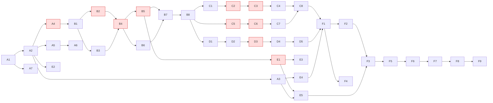

# 03 — Task Breakdown

**Inputs:** `docs/01-requirement-analysis.md`, `docs/02-architecture.md`, ADR-001…007
**Status:** Draft generated with AI assistance (Prompt 3) → pending engineer review
**Rules applied:** every task ≤ 2 h; every task has acceptance criteria, a quality gate, and a risk level; **H** (high-impact) tasks require an explicit engineer sign-off note in `docs/09` before merge.

Risk legend: **H** = touches schema, security surface, concurrency, or redirect hot path · **M** = behavior change with tests · **L** = additive / docs.

---

## 1. Backlog

### Group A — Foundation (Day 1, morning)

| ID | Task | Depends on | Seq | Acceptance criteria | Quality gate | Risk |
|----|------|-----------|-----|---------------------|--------------|------|
| A1 | Create repo, `docs/`, `prompts/`, `README` stub, `.gitignore`, MIT/none license decision | — | 1 | Repo public; link ends in `.git`; docs 01–03 committed | Repo visible from incognito | L |
| A2 | Spring Boot scaffold (Java 21, Maven, Web, JPA, Validation, Actuator, Flyway, H2, Postgres driver, springdoc) with `dev`/`docker` profiles | A1 | 2 | `mvn spring-boot:run -Dspring-boot.run.profiles=dev` starts; `/actuator/health` = UP | `mvn verify` green (empty test) | L |
| A3 | Docker Compose: Postgres 16 + service; Dockerfile (multi-stage, non-root) | A2 | 3 | `docker compose up --build` → health UP against Postgres | Compose up from clean clone | L |
| A4 | Flyway V1: `short_url` table, unique index on `code`, sequence `shorturl_seq` | A2 | 4 | Migration applies on both H2 (PG mode) and Postgres | Integration test boots against Testcontainers | **H** |
| A5 | Quality tooling: Spotless (google-java-format), Checkstyle, JaCoCo (80 % on `application`), surefire/failsafe split (`*Test`/`*IT`), OWASP dependency-check | A2 | 5 | `mvn verify` runs all gates; intentional format violation fails build | Gate self-test | L |
| A6 | GitHub Actions CI: build → spotless → unit → IT (Testcontainers) → JaCoCo → dependency-check → docker build | A5 | 6 | Green run on `main`; badge in README | CI green | M |
| A7 | Traceability log skeleton `docs/09` + prompt files 01–03 saved | A1 | 2 | Log has one row per prompt so far, with Generated/Edited/Rejected | Review | L |

### Group B — Greenfield: core APIs (Day 1, afternoon)

| ID | Task | Depends on | Seq | Acceptance criteria | Quality gate | Risk |
|----|------|-----------|-----|---------------------|--------------|------|
| B1 | Domain: `ShortUrl` entity, `ShortUrlRepository`, DTOs, `ProblemDetail` exception handler (ADR-006) | A4 | 7 | Entity maps V1 schema; handler returns problem+json for known exceptions; no stack traces in body | Unit test on handler | L |
| B2 | `UrlValidator`: http/https only, ≤ 2048 chars, host resolvable syntax, reject loopback/private/link-local/metadata (169.254.169.254) hosts | B1 | 8 | Table-driven unit test: 12+ cases incl. `file:`, `javascript:`, `http://localhost`, `http://10.0.0.1`, IPv6 loopback, IDN | Unit tests; **engineer security review** | **H** |
| B3 | `ShortCodeGenerator` interface + `RandomBase62Generator` (SecureRandom, 7 chars); reserved-word list (ADR-002) | B1 | 8 | 10 000 generated codes match `[0-9A-Za-z]{7}`; reserved words rejected | Unit tests | M |
| B4 | `UrlService.create`: validate → alias or generated code → save; collision retry ×3 → 503; alias conflict → 409 | B2, B3 | 9 | Unit tests with stubbed repo throwing `DataIntegrityViolationException` on 1st/2nd/4th attempt | Unit tests; JaCoCo | **H** |
| B5 | `UrlService.resolve` + `RedirectController`: 302 / 404 / 410 (expired or deleted); fixed `Clock` injected | B4 | 10 | Integration tests for all three outcomes | REST Assured IT | **H** (hot path) |
| B6 | `UrlController`: `POST /api/v1/urls` (201 + Location), `GET /api/v1/urls/{code}`, `DELETE` (soft, 204) | B4 | 10 | OpenAPI generated by springdoc matches behavior; Bean Validation on request body | REST Assured IT; openapi.yaml committed | M |
| B7 | Greenfield test suite consolidation: happy path, invalid URL, SSRF-blocked host, alias collision, expired, unknown, delete→410 | B5, B6 | 11 | All listed cases present; ≥ 80 % on `application`; suite deterministic (no sleeps, fixed clock) | `mvn verify` green; JaCoCo report pasted into `docs/04` | M |
| B8 | Write `docs/04-scenario-greenfield.md`: decomposition → execution → validation with pasted test output and log rows | B7 | 12 | Doc references task IDs, commits, prompt files, and at least one Rejected row | Review | L |

**Day-1 exit criterion:** B8 done, CI green, tag `v0.1-greenfield`. This tag is the "existing codebase" for the brownfield scenario.

### Group C — Brownfield: analytics enhancement + defect fix + refactor (Day 2, morning)

| ID | Task | Depends on | Seq | Acceptance criteria | Quality gate | Risk |
|----|------|-----------|-----|---------------------|--------------|------|
| C1 | Codebase impact analysis (Prompt 7): impacted classes, before/after data flow, sync vs async decision, migration plan, test impact — **no code** | B8 | 13 | `docs/05` §1 complete; engineer confirms analysis against actual code | Review + sign-off | L |
| C2 | Flyway V2: `click_event` table + index `(short_url_id, clicked_at)` | C1 | 14 | Applies on H2 and Postgres; V1 untouched | IT boot | **H** |
| C3 | `ClickRecorded` event, `@Async` listener, bounded executor (2/4/1000, DiscardPolicy), `analytics.events.dropped` counter; IP salted-hash; publish from `RedirectController` (ADR-004) | C2 | 15 | IT proves redirect 302 returns before click row exists, then row appears within 2 s (Awaitility); no raw IP in DB | IT; **engineer sign-off** (hot path) | **H** |
| C4 | `AnalyticsService` + `GET /api/v1/urls/{code}/stats`: total, per-day last 30 days, top 5 referrers | C3 | 16 | IT seeds events and asserts aggregates; 404 unknown code | REST Assured IT | M |
| C5 | Reproduce defect: concurrent test — 50 threads create same custom alias; expect exactly one 201, rest 409. **Approach (engineer decision):** branch `fix/alias-conflict` off `main`; commit 1 = failing test only (red state recorded in `docs/05` §3); commit 2 (C6) = fix. Expected failure mode: unhandled `DataIntegrityViolationException` → 500 instead of 409 | B8 | 13 | Failing test output + commit hash of red commit pasted into `docs/05` §3 | Testcontainers IT | **H** |
| C6 | Fix (commit 2 on `fix/alias-conflict`): DB unique constraint verified + service catches `DataIntegrityViolationException` on alias → `AliasConflictException` (409); C5 test green; merge via PR with red→green visible | C5 | 14 | C5 passes; all prior tests pass | IT; **engineer sign-off** | **H** |
| C7 | Refactor: add `SequenceBase62Generator`; select via `shortener.generator` property; no behavior change | C6 | 17 | Both generators pass same contract test; default unchanged; all tests green | Unit + IT | M |
| C8 | Write `docs/05-scenario-brownfield.md` §2–4: execution, validation, log rows | C4, C7 | 18 | Includes pasted failing→passing output and at least one Rejected row | Review | L |

### Group D — Ambiguous: rate limiting (Day 2, afternoon)

| ID | Task | Depends on | Seq | Acceptance criteria | Quality gate | Risk |
|----|------|-----------|-----|---------------------|--------------|------|
| D1 | Ambiguity resolution (Prompt 10): clarifying questions by scope/identity/limits/breach/storage/observability; recommended defaults; normalized spec + test list — **no code** | B8 | 13 | `docs/06` §1 complete with **engineer's answers** filled in | Review + sign-off | L |
| D2 | `RateLimiter` interface + in-memory token-bucket impl (Bucket4j or hand-rolled); config: per-client-IP, `POST /api/v1/urls` 10/min, `GET /{code}` 100/min (starting defaults confirmed by engineer; D1 may revise; redirect limit stays unless requirements explicitly remove it) | D1 | 19 | Unit test: bucket refill and exhaustion with fixed clock | Unit | M |
| D3 | `RateLimitFilter` (`OncePerRequestFilter`): 429 + `Retry-After` + problem+json; `X-Forwarded-For` handling decided in D1; exempt `/actuator/**` | D2 | 20 | IT: 11th POST in a minute → 429 with `Retry-After`; actuator never limited | REST Assured IT; **engineer sign-off** (touches hot path) | **H** |
| D4 | Metric `ratelimit.rejected` + log line with correlation ID | D3 | 21 | Visible at `/actuator/prometheus` | IT | L |
| D5 | Write `docs/06-scenario-ambiguous.md` §2–3: implementation, validation, what would change for production (Redis, API keys) | D4 | 22 | At least one Rejected row | Review | L |

### Group E — Reliability & observability (Day 2, late / Day 3, morning)

| ID | Task | Depends on | Seq | Acceptance criteria | Quality gate | Risk |
|----|------|-----------|-----|---------------------|--------------|------|
| E1 | Caffeine read-through cache on `resolve` (10 000 / 10 min), evict on delete, expiry re-checked on hit (ADR-005) | B5 | 23 | Test with repository spy: 2nd resolve hits cache, 0 repo calls; delete evicts | Unit + IT; **engineer sign-off** (hot path) | **H** |
| E2 | Correlation-ID filter (accept `X-Correlation-Id` or generate), MDC, logback JSON encoder | A2 | 23 | Log line contains correlation ID; ID echoed in response header and problem+json | IT | L |
| E3 | Micrometer: `redirect.latency` timer, `cache.hit.ratio` gauge, `shortener.collisions` counter; Prometheus endpoint | E1 | 24 | Metrics present after one redirect | IT | L |
| E4 | Health: DB indicator; liveness/readiness groups; graceful shutdown (`server.shutdown=graceful`) | A3 | 24 | `/actuator/health/readiness` DOWN when Postgres stopped | Manual + doc | M |
| E5 | k6 script: 500 RPS × 60 s on `GET /{code}` against Compose; record p50/p95/p99, error rate | E1, A3 | 25 | Results table in `docs/07`; bottleneck hypotheses | Report | L |

### Group F — Review, docs, submission (Day 3)

| ID | Task | Depends on | Seq | Acceptance criteria | Quality gate | Risk |
|----|------|-----------|-----|---------------------|--------------|------|
| F1 | AI adversarial security/quality review (Prompt 12): OWASP-mapped findings table; engineer triages must-fix vs defer | C8, D5, E4 | 26 | Findings table in `docs/08`; every must-fix has a commit | Review | M |
| F2 | Apply must-fix items from F1 | F1 | 27 | All tests green; CI green | CI | varies |
| F3 | `docs/07-testing-approach.md`: pyramid, gates, what each catches, coverage & perf numbers, what is not tested and why | E5, F2 | 28 | Numbers are pasted from real runs | Review | L |
| F4 | `docs/08-risks-tradeoffs.md`: risk table (likelihood/impact/mitigation/detection), trade-offs per ADR, limitations, next-week plan | F1 | 28 | Every ADR referenced | Review | L |
| F5 | README: quick start, curl examples, run tests, structure, config, doc links, Swagger UI link, CI badge | F3 | 29 | Fresh-clone dry run by engineer follows README verbatim | Manual | L |
| F6 | Complete `docs/09` traceability log: every prompt, every row classified, sign-off notes on all **H** tasks | all | 30 | ≥ 3 sign-off notes; ≥ 3 Rejected rows; commit hashes present | Review | L |
| F7 | `docs/10-final-engineering-summary.md` (Prompt 17) | F6 | 31 | Each §6 evaluation criterion addressed with evidence pointer | Review | L |
| F8 | Self-grade vs rubric (Prompt 18); fix top 3 gaps | F7 | 32 | Gap fixes committed | CI | L |
| F9 | Flip ADRs to Accepted; tag `v1.0`; verify `.git` link; submit | F8 | 33 | Clean-clone `docker compose up` works; CI green on tag | Final check | L |

---

## 2. Dependency Graph

Red nodes are **H** tasks requiring sign-off.

---

## 3. Critical Path

`A1 → A2 → A4 → B1 → B2 → B4 → B5 → B7 → B8 → C1 → C2 → C3 → C4 → C8 → F1 → F2 → F3 → F5 → F6 → F7 → F8 → F9`

- **Longest chain runs through the brownfield analytics track** (C1–C4). It cannot start until the greenfield tag exists.
- **Parallelizable:** C5–C7 (defect/refactor), D1–D5 (rate limiting), and E1–E4 can proceed in parallel with C1–C4 once B8 is done. If time is short, D-group can shrink to D1 + D2 + D3 (drop D4) without losing the scenario.
- **A3, A5, A6 are off the critical path** for Day 1 but must be done before Day 2 starts, or the brownfield ITs have no Postgres to run against.

---

## 4. Time Budget

| Day | Groups | Est. hours | Buffer |
|-----|--------|-----------|--------|
| 1 | A1–A7, B1–B8 | 9 | 1 h |
| 2 | C1–C8, D1–D5, E1–E2 | 9 | 1 h |
| 3 | E3–E5, F1–F9 | 7 | 2 h |

**If running behind, cut in this order:** E5 (k6) → D4 → E3 → C7 (refactor). Never cut: C5/C6 (the defect fix is the strongest brownfield evidence), D1 (the ambiguity doc is the scenario), F6/F7.

---

## 5. Sign-off Register (to be filled as H tasks merge)

| Task | Reviewed by | Date | Evidence checked | Decision |
|------|-------------|------|------------------|----------|
| A4 | | | | |
| B2 | | | | |
| B4 | | | | |
| B5 | | | | |
| C2 | | | | |
| C3 | | | | |
| C5 | | | | |
| C6 | | | | |
| D3 | | | | |
| E1 | | | | |

---

## 6. Engineer Review Log

| Item | Generated / Edited / Rejected | Note |
|------|-------------------------------|------|
| Full document | Generated | Initial draft. |
| D2 rate-limit defaults | Edited — **Sam** | Confirmed 10 POST/min and 100 redirect/min per client IP as starting defaults; D1 decides final values. Redirect limit is retained unless requirements explicitly call for removal. |
| §4 cut order | Reviewed — **Sam** | Agreed: k6 → rate-limit metric → Micrometer → generator refactor. Defect fix, ambiguity doc, traceability log, final summary are never cut. |
| C5/C6 approach | Edited — **Sam** | Branch `fix/alias-conflict` off `main`; commit 1 failing test (red), commit 2 fix (green), merged via PR. Recorded in `docs/09` and `docs/05`. |
