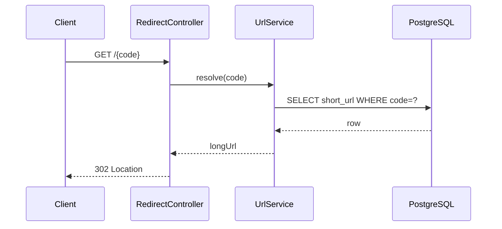
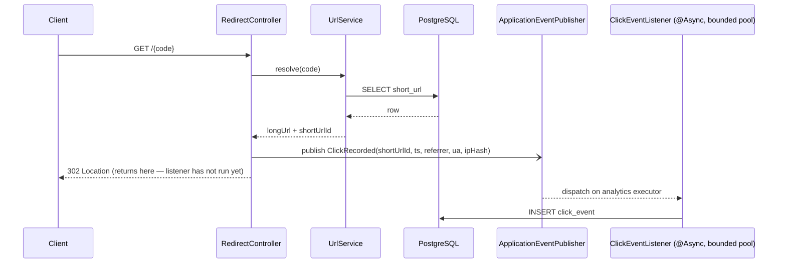

# 05 — Scenario 2: Brownfield (analytics enhancement + defect fix + refactor)

**Baseline ("existing code"):** tag `v0.1-greenfield` (`7c5ebb9`)
**Scope:** tasks C1–C8 in `docs/03-task-breakdown.md`
**Status:** §1 signed off · §2 implemented (C2–C4) · §3–§4 pending

---

## 1. Codebase impact analysis (task C1 — analysis only)

### 1.1 What exists today

| Layer | Class | Role in the redirect path | Touched by analytics? |
|-------|-------|---------------------------|-----------------------|
| api | `RedirectController` | `GET /{code}` → `UrlService.resolve` → 302 | **Yes** — publishes the click event |
| api | `GlobalExceptionHandler` | problem+json mapping | No (analytics failures must never reach it) |
| application | `UrlService.resolve` | `findByCode` → `isGone` check → return target | No — must stay untouched |
| application | `ShortenerProperties.Analytics` | `ipHashSalt` already bound from config | **Yes** — consumed by the hasher |
| domain | `ShortUrl` | aggregate for a link | No structural change; `ClickEvent` references its `id` |
| domain | `ShortUrlRepository` | `findByCode` | No |
| infrastructure | `V1__create_short_url.sql` | schema | No — **V2 adds a table; V1 is never edited** |
| config | `AppConfig.clock()` | injectable time | **Yes** — event timestamps use it |
| config | `UrlShortenerApplication` | already `@EnableAsync` | Executor bean to be added |

Nothing in `UrlService`, `ShortUrl`, or V1 changes. The enhancement is additive.

### 1.2 Data flow — before



### 1.3 Data flow — after (recommended: async in-process event)



Key property: the `302` is written before the `INSERT` runs. Analytics failure (DB down, queue full) is logged and counted, never propagated.

**Design note on `resolve`:** today it returns `String longUrl`. The event needs the `short_url.id` (FK) without a second lookup. Two options:
- (a) change `resolve` to return a small record `ResolvedTarget(id, longUrl)` — one-line signature change, `UrlServiceTest` adapts;
- (b) look the entity up again in the listener by code — extra query per click, off the hot path.
**Recommendation: (a).** It is a behaviour-preserving refactor with a mechanical test update; (b) doubles read load for no benefit.

### 1.4 Capture strategy comparison

| | A. Synchronous insert in `resolve` | **B. Spring `ApplicationEvent` + `@Async` bounded executor** | C. Kafka topic + consumer |
|---|---|---|---|
| Redirect latency impact | +1 DB write on hot path (~1–5 ms, more under contention) | ~0 — publish is an in-memory enqueue | ~0 (producer send is async) but adds broker round-trip variance |
| Failure isolation | **None** — DB write failure = redirect failure | Full — listener exceptions never reach the request thread | Full |
| Delivery guarantee | Exactly-once (same txn) | **At-most-once** (lost on crash / queue full) | At-least-once with durable log |
| New infrastructure | None | None | Broker container, topic, consumer group, DLQ, serialization |
| Multi-node ready | Yes | No (per-process queue) | Yes |
| Fits 2–3 day time-box | Yes | **Yes** | No — realistic estimate ≥ 1 day incl. tests |
| Testability | Trivial | IT with Awaitility proves ordering (302 before row) | Testcontainers Kafka; heavier |

**Recommendation: B**, exactly as ADR-004 proposed. Reasoning the engineer should be ready to defend: losing a click is acceptable for a click counter; blocking or failing a redirect is not. Kafka is the correct production shape and is the documented upgrade path — the event/listener seam means swapping the transport later touches one class.

Executor policy (also from ADR-004): core 2 / max 4 / queue 1000. Rejection: `DiscardPolicy` + increment `analytics.events.dropped`. **`CallerRunsPolicy` is rejected** — it would run the insert on the Tomcat thread, silently reintroducing option A under load.

### 1.5 Migration plan — `V2__create_click_event.sql`

```sql
CREATE TABLE click_event (
    id           BIGINT        NOT NULL PRIMARY KEY,
    short_url_id BIGINT        NOT NULL REFERENCES short_url(id),
    clicked_at   TIMESTAMP WITH TIME ZONE NOT NULL,
    referrer     VARCHAR(2048) NULL,
    user_agent   VARCHAR(512)  NULL,
    ip_hash      CHAR(64)      NOT NULL
);
CREATE SEQUENCE click_event_seq START WITH 1 INCREMENT BY 1;
CREATE INDEX ix_click_event_url_time ON click_event (short_url_id, clicked_at);
```

- Additive only; V1 untouched; existing rows unaffected.
- FK to `short_url(id)` with **no cascade** — soft delete (ADR-007) keeps history queryable.
- Index `(short_url_id, clicked_at)` serves both "total for link" and "per day, last 30 days" with a range scan; referrer aggregation is a filtered scan on the same index then group-by — acceptable at prototype scale, noted as a limit.
- `ip_hash` is `SHA-256(salt || ip)` hex; salt from `shortener.analytics.ip-hash-salt`. Raw IP never persisted, never logged.
- Runs unchanged on H2 (PG mode) and PostgreSQL 16 — same pattern as V1.

### 1.6 API surface added

| Method | Path | Response |
|--------|------|----------|
| GET | `/api/v1/urls/{code}/stats` | `{ totalClicks, clicksByDay: [{date, count}] (last 30 days), topReferrers: [{referrer, count}] (top 5) }` — 404 for unknown code; deleted/expired links still return stats |

No change to existing endpoints or response shapes.

### 1.7 Test impact

**Existing tests that change**
- `UrlServiceTest.resolvesLiveLink` — return type becomes `ResolvedTarget`; assert `longUrl()` instead of the String. Mechanical.
- `UrlApiIT.createThenRedirect` — unchanged assertions; the redirect path now publishes an event, but the test does not observe it. Should still pass unmodified (regression guard).

**New tests**
- `ClickEventListenerTest` (unit) — hashes IP with salt; never stores raw IP; tolerates null referrer/UA.
- `AnalyticsServiceTest` (unit, mocked repo) — aggregation shaping for empty, single-day, and 30-day windows using fixed `Clock`.
- `AnalyticsIT` (Postgres) —
  1. redirect returns 302 **before** the click row exists, then row appears (Awaitility, ≤ 2 s);
  2. stats endpoint totals and per-day buckets after N seeded clicks via `MutableClock` advances;
  3. stats for a deleted link still return (ADR-007);
  4. `ip_hash` column matches expected SHA-256 and does not contain the IP.
- `ClickEventRejectionTest` (unit) — saturated executor increments `analytics.events.dropped`, never throws.

### 1.8 Risks introduced

| Risk | Mitigation | Detection |
|------|-----------|-----------|
| Listener accidentally runs synchronously (missing `@Async` proxy, self-invocation) | IT #1 asserts 302 precedes row | Awaitility timing in IT |
| Queue saturation under load drops clicks silently | Metric `analytics.events.dropped`; documented at-most-once | Prometheus counter |
| Event carries a JPA entity across threads → `LazyInitializationException` | Event carries primitives (`long shortUrlId`), never the entity | Unit test + code review |
| `resolve` signature change ripples | Only `RedirectController` and `UrlServiceTest` reference it | Compiler |
| Stats query cost grows with click volume | Index on `(short_url_id, clicked_at)`; 30-day window bound | Explain plan noted in docs/07 |

### 1.9 Decision block — engineer sign-off required before C2

| # | Decision | AI recommendation | Engineer |
|---|----------|-------------------|----------|
| D-1 | Capture strategy | B — async in-process event | ☑ Accept |
| D-2 | `resolve` returns `ResolvedTarget(id, longUrl)` | Option (a) | ☑ Accept |
| D-3 | Executor 2/4/1000, `DiscardPolicy`, dropped-events counter | As ADR-004 | ☑ Accept |
| D-4 | Store salted SHA-256 of IP only | Yes | ☑ Accept |
| D-5 | Stats remain available for deleted/expired links | Yes (ADR-007) | ☑ Accept |
| D-6 | `topReferrers` limit | 5 | ☑ Accept |

Signed: Masud Siraj   Date: 2026-08-27

---

## 2. Execution — analytics (C2–C4)

Commit `be38351` on `main`.

### 2.1 What was built

| Task | Artifact |
|------|----------|
| C2 | `V2__create_click_event.sql` — table, FK to `short_url(id)` (no cascade), index `(short_url_id, clicked_at)`, sequence |
| C3 | `ClickRecorded` event · `ClickEventListener` (`@Async` on `analyticsExecutor`) · `AnalyticsExecutorConfig` (2/4/1000, discard + `analytics.events.dropped`) · `IpHasher` (salted SHA-256) · `RedirectController` publishes |
| C4 | `AnalyticsService` · `StatsController` → `GET /api/v1/urls/{code}/stats` |
| D-2 | `UrlService.resolve` returns `ResolvedTarget(shortUrlId, longUrl)` |

`UrlService.resolve` logic, `ShortUrl`, and `V1` were not modified beyond the return type — the enhancement is additive as the analysis predicted.

### 2.2 Engineer edits to AI output

| AI output | Trigger | Action |
|-----------|---------|--------|
| `V2` declared `ip_hash CHAR(64)` | `ApplicationContextTest` failed to load on H2 — Hibernate `ddl-auto: validate` expects `VARCHAR` for a `String` field | **Edited** to `VARCHAR(64)`. Postgres tolerated `CHAR`; H2 did not. Migration had not been applied anywhere, so editing V2 in place was safe. |
| `UrlServiceTest.resolvesLiveLink` | NPE — stub entity had `id == null`, unboxed by `ResolvedTarget(long,…)` | **Edited** — test now sets an id via reflection, and asserts `shortUrlId()` too |

### 2.3 Validation

```
Successfully applied 3 migrations to schema "public", now at version v3   (H2 and PostgreSQL 16)
Found 2 JPA repository interfaces
[INFO] Tests run: 84, Failures: 0, Errors: 0, Skipped: 0    -- surefire
[INFO] Tests run: 19, Failures: 0, Errors: 0, Skipped: 0    -- failsafe (Testcontainers)
[INFO] All coverage checks have been met.
[INFO] BUILD SUCCESS
```

`AnalyticsIT` proves: the click row appears after the 302 (Awaitility, ≤2 s); per-day and per-referrer aggregation across a `MutableClock` day boundary; stats still returned for a soft-deleted link (ADR-007 / D-5); 404 for unknown code; `ip_hash` is 64 hex chars and contains no substring of the client address.

### 2.4 Known limits carried to `docs/08`
- At-most-once delivery: a crash or a saturated queue drops clicks (counter `analytics.events.dropped`).
- Aggregation is in-memory over a 30-day window, not SQL `GROUP BY` — portable across H2/Postgres and index-bounded, but it will not scale past tens of thousands of clicks per link.
- `AnalyticsIT` asserts the row appears asynchronously; it does not assert the response was flushed first. That ordering follows from `@Async`, not from an assertion.

---

## 3. Defect reproduction and fix (C5–C6)

Branch `fix/alias-conflict`, merged to `main` as PR #1 (`6435d28`).

### 3.1 Hypothesis
`UrlService.createWithAlias` calls `saveAndFlush`. The V1 unique index `ux_short_url_code` guarantees one winner under concurrency, but the losing insert raises `DataIntegrityViolationException`, which no handler maps — so `GlobalExceptionHandler.onUnexpected` returns **500** instead of **409**.

### 3.2 Red — commit `829b92d` (failing test only)
`AliasConcurrencyIT`: 50 threads released by a `CountDownLatch` POST the same custom alias to Testcontainers PostgreSQL; contract is exactly one 201 and 49× 409.

```
[ERROR] Tests run: 1, Failures: 1, Errors: 0 -- in com.siraj.shortener.api.AliasConcurrencyIT
[no unexpected statuses (got [500, 500, 500, 500, 500, 500, 500, 500, 500, 500, 500, 500,
 500, 500, 500, 500, 500, 500, 500, 500, 500, 500, 500, 500, 500, 500, 500, 500, 500, 500,
 500, 500, 500, 500, 500, 500, 500, 500, 500, 500, 500, 500, 500, 201, 500, 500, 500, 500,
 500, 500])]
expected: 0L
```

Exactly one 201 — the database constraint worked. Forty-nine 500s — the application contract did not. Hypothesis confirmed at both levels.

### 3.3 Green — commit `17183dc`
Fix is at **both** levels, as required by task C6:
- **Database:** unique index `ux_short_url_code` verified present in V1 (no change needed — the red run proved it enforces single-winner).
- **Application:** `createWithAlias` catches `DataIntegrityViolationException` and throws `AliasConflictException`, which the existing `@RestControllerAdvice` already maps to 409 problem+json.

```java
try {
  ShortUrl saved = repository.saveAndFlush(new ShortUrl(alias, cmd.longUrl(), true, now, cmd.expiresAt()));
  return ShortUrlView.from(saved, props.baseUrl());
} catch (DataIntegrityViolationException e) {
  // Two requests raced on the same alias; the unique index chose the winner. Loser gets 409.
  throw new AliasConflictException(alias);
}
```

After: `AliasConcurrencyIT` green (1× 201, 49× 409), all prior tests unaffected. A unit test (`customAliasCollisionIsMappedToConflict`) covers the branch without needing 50 threads.

### 3.4 Why the defect was left in at v0.1
Deliberate, recorded in `docs/09` row 8: the engineer removed the AI's explanatory comment marking the gap so the defect would be *discovered* by a test in the brownfield scenario rather than signposted in the greenfield code.

---

## 4. Refactor — `SequenceBase62Generator` (C7)

Commit `ce9614a`. Behaviour-preserving: default remains `shortener.generator=random`.

- `SequenceBase62Generator` implements the existing `ShortCodeGenerator` port, activated by `@ConditionalOnProperty(havingValue = "sequence")`.
- `V3__create_short_code_seq.sql` adds a **dedicated** sequence starting at 62⁴, so switching generators never consumes entity-id values from `shorturl_seq`.
- `ShortCodeGeneratorContract` is an abstract TestNG class asserting alphabet, length and uniqueness; both implementations extend it. Adding a third generator later inherits the contract for free.
- Engineer edit: the AI's expected value in `isMonotonicAndDeterministic` was wrong (`00001C` for 100; correct base62 is `000001c`). Generator was right, assertion was not — corrected.

All 84 unit + 19 integration tests green after the refactor; no production behaviour changed.
